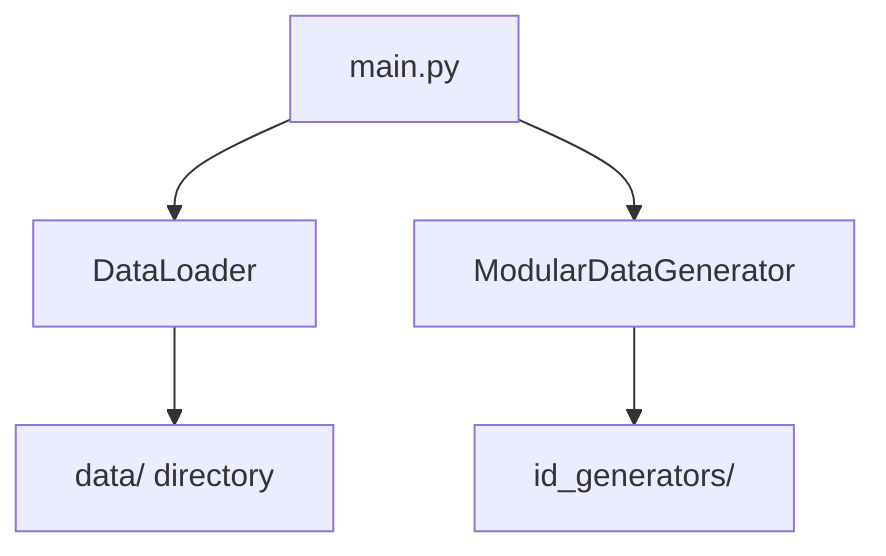

# Modular Data Generator

A flexible data generator that automatically adapts to available datasets.

## Features

- **Dynamic Data Loading**: Automatically discovers available locales and data types
- **Modular Architecture**: Easily extend with new data types and generators
- **CSV Export**: Save generated data in standard CSV format

## Getting Started

1. Install requirements:
```bash
pip install -r requirements.txt
```

2. Run the application:
```bash
python main.py
```

## Adding New Data

1. Create a new locale directory in `data/` (e.g. `data/fr/`)
2. Add data files with format `DataType.txt` (e.g. `Cities.txt`, `Jobs.txt`)
3. The system will automatically detect and include the new data

Example structure:
```
data/
  fr/
    Cities.txt
    Jobs.txt
    Names.txt
```

## Adding ID Generators

1. Create a new module in `generators/id_generators/` following the pattern `pesel_[locale].py`
2. Implement the `generate_id_number()` function that returns (id_number, birth_date)
3. The system will automatically load it when the locale is selected

## Architecture



## Requirements

- Python 3.8+
- tkinter (usually included with Python)
